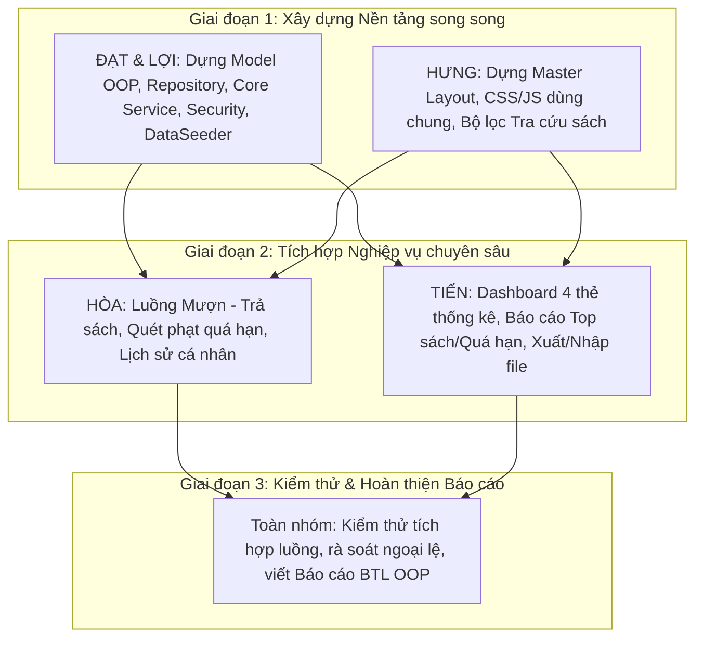

# TÀI LIỆU THIẾT KẾ KIẾN TRÚC VÀ HƯỚNG DẪN TRIỂN KHAI DỰ ÁN
## BÀI TẬP LỚN LẬP TRÌNH HƯỚNG ĐỐI TƯỢNG (OOP)
### ĐỀ TÀI: HỆ THỐNG QUẢN LÝ THƯ VIỆN (LIBRARY MANAGEMENT SYSTEM)

---

## MỤC LỤC
1. [Giới thiệu chung & Phân chia công việc theo mảng](#1-giới-thiệu-chung--phân-chia-công-việc-theo-mảng)
   - [1.1. Mục tiêu đề tài](#11-mục-tiêu-đề-tài)
   - [1.2. Bảng phân chia công việc theo nhóm phụ trách](#12-bảng-phân-chia-công-việc-theo-nhóm-phụ-trách)
   - [1.3. Lộ trình tích hợp mã nguồn (Roadmap 3 giai đoạn)](#13-lộ-trình-tích-hợp-mã-nguồn-roadmap-3-giai-đoạn)
2. [Phân tích hệ thống & Áp dụng 4 tính chất OOP](#2-phân-tích-hệ-thống--áp-dụng-4-tính-chất-oop)
   - [2.1. Tính đóng gói (Encapsulation)](#21-tính-đóng-gói-encapsulation)
   - [2.2. Tính kế thừa (Inheritance)](#22-tính-kế-thừa-inheritance)
   - [2.3. Tính đa hình (Polymorphism)](#23-tính-đa-hình-polymorphism)
   - [2.4. Tính trừu tượng (Abstraction)](#24-tính-trừu-tượng-abstraction)
3. [Thiết kế kiến trúc & Cây thư mục dự án](#3-thiết-kế-kiến-trúc--cây-thư-mục-dự-án)
   - [3.1. Kiến trúc phân tầng MVC trong Spring Boot](#31-kiến-trúc-phân-tầng-mvc-trong-spring-boot)
   - [3.2. Cây thư mục và danh sách toàn bộ các file của dự án](#32-cây-thư-mục-và-danh-sách-toàn-bộ-các-file-của-dự-án)
4. [Hướng dẫn triển khai chi tiết theo từng phần công việc](#4-hướng-dẫn-triển-khai-chi-tiết-theo-từng-phần-công-việc)
   - [4.1. Hướng dẫn cho ĐẠT & LỢI: Tầng Dữ liệu, Model, Repository, Core Service & Quản lý Độc giả, Khởi tạo dữ liệu](#41-hướng-dẫn-cho-đạt--lợi-tầng-dữ-liệu-model-repository-core-service--quản-lý-độc-giả-khởi-tạo-dữ-liệu)
   - [4.2. Hướng dẫn cho HƯNG: Khung Giao diện Master Layout, CSS/JS & Tra cứu Sách](#42-hướng-dẫn-cho-hưng-khung-giao-diện-master-layout-cssjs--tra-cứu-sách)
   - [4.3. Hướng dẫn cho HÒA: Nghiệp vụ Mượn - Trả Sách, Quét Quá hạn & Tính Phạt](#43-hướng-dẫn-cho-hòa-nghiệp-vụ-mượn---trả-sách-quét-quá-hạn--tính-phạt)
   - [4.4. Hướng dẫn cho TIẾN: Dashboard Tổng quan, Báo cáo Thống kê & Nhập/Xuất File](#44-hướng-dẫn-cho-tiến-dashboard-tổng-quan-báo-cáo-thống-kê--nhậpxuất-file)
5. [Quy chuẩn làm việc nhóm & Git Workflow](#5-quy-chuẩn-làm-việc-nhóm--git-workflow)
   - [5.1. Phân chia nhánh Git (Branching Strategy)](#51-phân-chia-nhánh-git-branching-strategy)
   - [5.2. Quy chuẩn Commit Message](#52-quy-chuẩn-commit-message)
   - [5.3. Trình tự Merge code tránh xung đột](#53-trình-tự-merge-code-tránh-xung-đột)

---

## 1. GIỚI THIỆU CHUNG & PHÂN CHIA CÔNG VIỆC THEO MẢNG

### 1.1. Mục tiêu đề tài
- Xây dựng một ứng dụng web Quản lý Thư viện hoàn chỉnh theo mô hình **MVC** dựa trên hệ sinh thái **Java Spring Boot 3**, **Spring Data JPA**, **Spring Security** kết hợp giao diện **Thymeleaf** và **Bootstrap 5**.
- Vận dụng chặt chẽ 4 tính chất của **Lập trình hướng đối tượng (OOP)**: Đóng gói, Kế thừa, Đa hình, Trừu tượng.
- Phục vụ hai nhóm đối tượng:
  - **ROLE_ADMIN (Thủ thư / Quản trị viên)**: Quản lý danh mục tài liệu, kho hàng, độc giả, xử lý mượn/trả, giám sát báo cáo quá hạn, thống kê Dashboard, nhập/xuất danh mục sách.
  - **ROLE_READER (Độc giả)**: Tìm kiếm và tra cứu sách nâng cao, xem chi tiết tài liệu, theo dõi lịch sử mượn trả cá nhân và quản lý thông tin tài khoản.

---

### 1.2. Bảng phân chia công việc theo nhóm phụ trách

| Phân nhóm | Thành viên đảm nhận | Mảng chức năng phụ trách | Chi tiết nhiệm vụ |
| :--- | :--- | :--- | :--- |
| **Nhóm Core Backend** | **ĐẠT & LỢI** | **Tầng Dữ liệu, Model OOP, Repository, Core Service, Độc giả & Data Seeder** | - Xây dựng các Entity OOP: Lớp cha trừu tượng `Document`, 2 lớp con `Book` và `Magazine`, thực thể `User`, `BaseEntity`.<br>- Viết các JPA Repositories: `DocumentRepository`, `BookRepository`, `MagazineRepository`, `UserRepository`.<br>- Viết Services: `DocumentService` (CRUD Sách/Tạp chí, validate ISBN duy nhất, số lượng $>0$), `UserService` (CRUD độc giả, khóa/mở khóa tài khoản `active = true/false`).<br>- Viết phương thức cốt lõi dùng chung `updateStock(Long docId, int quantityChange)` có `@Transactional`.<br>- Ràng buộc xóa tài liệu: Chặn xóa nếu sách đang có người mượn (`BORROWING`).<br>- Cấu hình Spring Security (`SecurityConfig`): Mã hóa mật khẩu bằng `BCryptPasswordEncoder`, phân quyền theo Role.<br>- Viết `DataSeeder` (`CommandLineRunner`): Tự động tạo Admin (`admin`/`123456`), 2 Độc giả mẫu, 10 sách/tạp chí mẫu. |
| **Giao diện Master** | **HƯNG** | **Khung Giao diện Master Layout chung, CSS/JS & Tra cứu** | - Xây dựng bộ khung **Master Layout** dùng chung cho toàn dự án: `base.html`, `navbar.html`, `sidebar.html`, `footer.html`, `alerts.html`, `modal_confirm.html`.<br>- Thiết kế phong cách CSS chuẩn hiện đại (`custom.css`), hiệu ứng và JS dùng chung (`main.js`).<br>- Xây dựng trang danh mục & bộ lọc tra cứu sách nâng cao (`home/index.html`) hỗ trợ 2 chế độ: Dạng Bảng cho Admin và Dạng Card lưới có bìa sách cho Độc giả.<br>- Dựng các mẫu form Thêm/Sửa chuẩn Bootstrap 5 để các thành viên khác tái sử dụng. |
| **Nghiệp vụ Mượn/Trả** | **HÒA** | **Nghiệp vụ Mượn - Trả Sách, Quét Quá hạn & Tính Phạt** | - Thiết kế Model `BorrowRecord`, Enum `BorrowStatus` (`BORROWING`, `RETURNED`, `OVERDUE`).<br>- Viết `BorrowRecordRepository`, `BorrowService` & `BorrowController`.<br>- Xử lý luồng Lập phiếu mượn: Kiểm tra tồn kho $>0$, độc giả mượn tối đa 5 cuốn, không nợ sách quá hạn, gọi `updateStock(docId, -1)`.<br>- Xử lý luồng Trả sách: Cập nhật ngày trả, đổi trạng thái `RETURNED`, hoàn trả kho `updateStock(docId, +1)`.<br>- Logic quét & đánh dấu quá hạn (`OVERDUE`), tính tiền phạt trễ hạn (5.000 VNĐ/ngày).<br>- Giao diện Lịch sử mượn cá nhân cho Độc giả (2 Tab: Đang mượn & Đã trả). |
| **Thống kê & File** | **TIẾN** | **Dashboard Tổng quan, Báo cáo Thống kê & Nhập/Xuất File** | - Xây dựng DTO `DashboardStatsDto`, `TopBookDto`.<br>- Viết `ReportService` & `ReportController`.<br>- Xây dựng trang **Dashboard Tổng quan** (`dashboard.html`): 4 thẻ thống kê trực quan (Tổng sách, Độc giả active, Phiếu đang mượn, Phiếu quá hạn đỏ) + Bảng 5 giao dịch gần nhất.<br>- Báo cáo thống kê: Top 5/10 sách được mượn nhiều nhất, Báo cáo danh sách độc giả quá hạn kèm số ngày và tiền phạt.<br>- Nhập/Xuất File: Xuất danh mục sách ra file Excel/CSV; Batch import danh mục sách từ file CSV. |

---

### 1.3. Lộ trình tích hợp mã nguồn (Roadmap 3 giai đoạn)



---

## 2. PHÂN TÍCH HỆ THỐNG & ÁP DỤNG 4 TÍNH CHẤT OOP

### 2.1. Tính đóng gói (Encapsulation)
- Toàn bộ thuộc tính trong các lớp thực thể (`Document`, `Book`, `Magazine`, `User`, `BorrowRecord`) đều để phạm vi truy cập `private`.
- Truy xuất và sửa đổi dữ liệu thông qua các phương thức Getter/Setter và Constructor.
- Đóng gói các quy tắc nghiệp vụ ngay trong lớp thực thể:
  - Kiểm tra tài liệu còn trong kho: `isAvailable() { return this.quantity > 0; }`.
  - Tính số ngày trễ hạn: `calculateOverdueDays()`.
  - Tính tiền phạt tự động: `calculateFine(5000L)`.
  - Kiểm tra ràng buộc hợp lệ bằng Bean Validation Annotations (`@NotBlank`, `@Min`, `@Max`, `@Email`, `@Size`).

### 2.2. Tính kế thừa (Inheritance)
- **`BaseEntity`**: Lớp cơ sở chứa các trường audit `createdAt`, `updatedAt` kèm các hook `@PrePersist`, `@PreUpdate` giúp tái sử dụng mã nguồn.
- **`Document` (Lớp cha trừu tượng)**: Đại diện cho tài liệu tổng quát trong thư viện, chứa các thuộc tính dùng chung: `id`, `title`, `publisher`, `publishYear`, `quantity`, `documentType`, `imageUrl`.
- **Hai lớp con kế thừa từ `Document`**:
  - `Book extends Document`: Kế thừa thuộc tính chung, bổ sung các trường đặc thù của sách: `author`, `isbn` (mã định danh duy nhất), `pageCount`, `genre`.
  - `Magazine extends Document`: Kế thừa thuộc tính chung, bổ sung các trường đặc thù của tạp chí: `issueNumber` (Số phát hành), `publishMonth` (Tháng phát hành từ 1 đến 12).
- Ánh xạ JPA: Sử dụng chiến lược `@Inheritance(strategy = InheritanceType.JOINED)` giúp cơ sở dữ liệu chuẩn hóa, tách bảng `documents`, `books`, `magazines` nhưng quản lý kế thừa trong Java hoàn toàn tự nhiên.

### 2.3. Tính đa hình (Polymorphism)
- **Ghi đè phương thức (Method Overriding)**:
  - Lớp cha trừu tượng `Document` định nghĩa 2 phương thức trừu tượng:
    ```java
    public abstract String getDocumentDetails();
    public abstract String getIdentifierCode();
    ```
  - Lớp con `Book` override: Trả về chuỗi thông tin Tác giả, ISBN, Số trang.
  - Lớp con `Magazine` override: Trả về chuỗi Số phát hành, Tháng/Năm phát hành.
- **Đa hình thông qua Interface**:
  - `BorrowService` thao tác mượn/trả trên đối tượng cha `Document`. Dù người đọc mượn một cuốn Sách hay một cuốn Tạp chí, hệ thống đều tiếp nhận và xử lý mượn trả đồng nhất qua đối tượng `Document`.

### 2.4. Tính trừu tượng (Abstraction)
- Tách biệt hoàn toàn giữa **Khai báo giao diện (Interface)** và **Cài đặt cụ thể (Implementation)** ở tầng nghiệp vụ (Service layer):
  - `DocumentService` $\rightarrow$ `DocumentServiceImpl`
  - `BorrowService` $\rightarrow$ `BorrowServiceImpl`
  - `UserService` $\rightarrow$ `UserServiceImpl`
  - `ReportService` $\rightarrow$ `ReportServiceImpl`
- Các Controller chỉ giao tiếp với Interface thông qua cơ chế Dependency Injection (`@Autowired`), che giấu hoàn toàn chi tiết xử lý câu lệnh SQL hay logic nội bộ bên dưới.

---

## 3. THIẾT KẾ KIẾN TRÚC & CÂY THƯ MỤC DỰ ÁN

### 3.1. Kiến trúc phân tầng MVC trong Spring Boot
```
Client (Trình duyệt) 
   │ [HTTP Request: GET/POST]
   ▼
DispatcherServlet ──► Controller (Điều hướng Request & Kiểm tra Form DTO)
                           │
                           ▼
                      Service Interface (Xử lý Logic Nghiệp vụ & Ràng buộc OOP)
                           │
                           ▼
                      Repository (Spring Data JPA thực thi truy vấn)
                           │
                           ▼
                      Database (H2 / MySQL)
                           │
      [Trả Model] ◄────────┴──────── [Trả Entity]
         │
         ▼
Thymeleaf View Engine (Render HTML kết hợp Khung Master Layout)
         │
         ▼
Client nhận trang HTML + CSS + JS hoàn chỉnh
```

---

### 3.2. Cây thư mục và danh sách toàn bộ các file của dự án

```text
library-management/
├── pom.xml                                         # Quản lý dependencies Maven
├── src/
│   ├── main/
│   │   ├── java/com/library/
│   │   │   ├── LibraryApplication.java             # Entry point khởi chạy ứng dụng
│   │   │   │
│   │   │   ├── config/                             # CẤU HÌNH HỆ THỐNG & BẢO MẬT
│   │   │   │   ├── SecurityConfig.java             # Cấu hình Spring Security phân quyền [ĐẠT & LỢI]
│   │   │   │   └── WebMvcConfig.java               # Cấu hình đường dẫn tài nguyên tĩnh static [HƯNG]
│   │   │   │
│   │   │   ├── core/                               # NỀN TẢNG DÙNG CHUNG
│   │   │   │   ├── BaseEntity.java                 # Lớp cha chứa createdAt, updatedAt [ĐẠT & LỢI]
│   │   │   │   └── DataSeeder.java                 # CommandLineRunner tạo dữ liệu mẫu [ĐẠT & LỢI]
│   │   │   │
│   │   │   ├── enums/                              # CÁC KIỂU HẰNG SỐ LIỆT KÊ
│   │   │   │   ├── RoleName.java                   # ROLE_ADMIN, ROLE_READER [ĐẠT & LỢI]
│   │   │   │   ├── DocumentType.java               # BOOK, MAGAZINE [ĐẠT & LỢI]
│   │   │   │   └── BorrowStatus.java               # BORROWING, RETURNED, OVERDUE [HÒA]
│   │   │   │
│   │   │   ├── model/                              # CÁC THỰC THỂ CSDL (JPA ENTITY)
│   │   │   │   ├── Document.java                   # [Lớp cha trừu tượng] Kế thừa BaseEntity [ĐẠT & LỢI]
│   │   │   │   ├── Book.java                       # [Lớp con] Kế thừa Document [ĐẠT & LỢI]
│   │   │   │   ├── Magazine.java                   # [Lớp con] Kế thừa Document [ĐẠT & LỢI]
│   │   │   │   ├── User.java                       # Thực thể Độc giả & Thủ thư [ĐẠT & LỢI]
│   │   │   │   └── BorrowRecord.java               # Thực thể Phiếu mượn - trả sách [HÒA]
│   │   │   │
│   │   │   ├── dto/                                # DATA TRANSFER OBJECT (FORM BINDING)
│   │   │   │   ├── BookFormDto.java                # Form nhập/sửa Sách [ĐẠT & LỢI]
│   │   │   │   ├── MagazineFormDto.java            # Form nhập/sửa Tạp chí [ĐẠT & LỢI]
│   │   │   │   ├── UserFormDto.java                # Form độc giả [ĐẠT & LỢI]
│   │   │   │   ├── BorrowRequestDto.java           # Form lập phiếu mượn [HÒA]
│   │   │   │   ├── DashboardStatsDto.java          # Chứa 4 chỉ số thống kê Dashboard [TIẾN]
│   │   │   │   └── TopBookDto.java                 # DTO hiển thị danh sách Top sách mượn [TIẾN]
│   │   │   │
│   │   │   ├── repository/                         # TẦNG TRUY XUẤT CSDL (JPA REPOSITORY)
│   │   │   │   ├── DocumentRepository.java         # Truy vấn tìm kiếm lọc sách đa tiêu chí [ĐẠT & LỢI]
│   │   │   │   ├── BookRepository.java             # Quản lý riêng Sách (check ISBN) [ĐẠT & LỢI]
│   │   │   │   ├── MagazineRepository.java         # Quản lý riêng Tạp chí [ĐẠT & LỢI]
│   │   │   │   ├── UserRepository.java             # Quản lý Người dùng [ĐẠT & LỢI]
│   │   │   │   └── BorrowRecordRepository.java     # Quản lý Phiếu mượn, quá hạn, top sách [HÒA & TIẾN]
│   │   │   │
│   │   │   ├── service/                            # TẦNG GIAO DIỆN NGHIỆP VỤ (INTERFACES)
│   │   │   │   ├── DocumentService.java            # Quản lý tài liệu, kho hàng [ĐẠT & LỢI]
│   │   │   │   ├── UserService.java                # Quản lý độc giả, trạng thái active [ĐẠT & LỢI]
│   │   │   │   ├── BorrowService.java              # Lập phiếu mượn, trả sách, quét quá hạn [HÒA]
│   │   │   │   ├── ReportService.java              # Dữ liệu Dashboard, thống kê Top sách, file [TIẾN]
│   │   │   │   │
│   │   │   │   └── impl/                           # TẦNG CÀI ĐẶT NGHIỆP VỤ CHI TIẾT
│   │   │   │       ├── DocumentServiceImpl.java    # Cài đặt DocumentService + updateStock [ĐẠT & LỢI]
│   │   │   │       ├── UserServiceImpl.java        # Cài đặt UserService [ĐẠT & LỢI]
│   │   │   │       ├── BorrowServiceImpl.java      # Cài đặt BorrowService [HÒA]
│   │   │   │       └── ReportServiceImpl.java      # Cài đặt ReportService [TIẾN]
│   │   │   │
│   │   │   └── controller/                         # TẦNG ĐIỀU HƯỚNG REQUEST (SPRING MVC)
│   │   │       ├── AuthController.java             # Đăng nhập, đăng ký [ĐẠT & LỢI]
│   │   │       ├── HomeController.java             # Trang chủ, tra cứu sách công khai [HƯNG]
│   │   │       ├── DocumentController.java         # CRUD Sách & Tạp chí cho Admin [ĐẠT & LỢI]
│   │   │       ├── UserController.java             # Quản lý Độc giả cho Admin [ĐẠT & LỢI]
│   │   │       ├── BorrowController.java           # Lập phiếu, trả sách, lịch sử mượn [HÒA]
│   │   │       └── ReportController.java           # Dashboard, Báo cáo & Nhập/Xuất file [TIẾN]
│   │   │
│   │   └── resources/
│   │       ├── application.properties              # Cấu hình CSDL (H2/MySQL), Port, Thymeleaf, File upload
│   │       │
│   │       ├── static/                             # TÀI NGUYÊN TĨNH GIAO DIỆN [HƯNG PHỤ TRÁCH]
│   │       │   ├── css/
│   │       │   │   ├── bootstrap.min.css           # Thư viện Bootstrap 5 (hoặc dùng CDN)
│   │       │   │   └── custom.css                  # CSS giao diện tùy biến (màu sắc, card, badge)
│   │       │   ├── js/
│   │       │   │   ├── bootstrap.bundle.min.js     # Thư viện JS Bootstrap 5
│   │       │   │   └── main.js                     # Script Modal confirm xóa, search nhanh, active tab
│   │       │   └── images/
│   │       │       ├── logo.png                    # Logo thư viện
│   │       │       ├── default-book.png            # Bìa sách mặc định
│   │       │       └── default-avatar.png          # Avatar người dùng mặc định
│   │       │
│   │       └── templates/                          # GIAO DIỆN HTML THYMELEAF
│   │           ├── layout/                         # BỘ KHUNG MASTER LAYOUT DÙNG CHUNG [HƯNG PHỤ TRÁCH]
│   │           │   ├── base.html                   # Layout gốc chứa Navbar, Sidebar, Footer
│   │           │   ├── navbar.html                 # Thanh điều hướng trên cùng
│   │           │   ├── sidebar.html                # Menu bên trái cho Admin
│   │           │   ├── footer.html                 # Chân trang bản quyền
│   │           │   ├── alerts.html                 # Thông báo Flash message (Success / Error)
│   │           │   └── modal_confirm.html          # Modal xác nhận xóa dùng chung
│   │           │
│   │           ├── auth/                           # GIAO DIỆN XÁC THỰC [ĐẠT & LỢI + HƯNG]
│   │           │   └── login.html                  # Form đăng nhập chuẩn đẹp
│   │           │
│   │           ├── home/                           # TRANG CHỦ & DASHBOARD
│   │           │   ├── index.html                  # Trang chủ tra cứu sách (Bảng & Card lưới) [HƯNG]
│   │           │   └── dashboard.html              # Dashboard 4 thẻ thống kê + 5 giao dịch [TIẾN]
│   │           │
│   │           ├── documents/                      # QUẢN LÝ SÁCH & TẠP CHÍ [ĐẠT & LỢI + HƯNG]
│   │           │   ├── list.html                   # Danh sách tài liệu kèm bộ lọc [ĐẠT & LỢI + HƯNG]
│   │           │   ├── add_book.html               # Form thêm/sửa Sách [ĐẠT & LỢI]
│   │           │   ├── add_magazine.html           # Form thêm/sửa Tạp chí [ĐẠT & LỢI]
│   │           │   └── detail.html                 # Chi tiết tài liệu [ĐẠT & LỢI]
│   │           │
│   │           ├── borrow/                         # NGHIỆP VỤ MƯỢN - TRẢ [HÒA]
│   │           │   ├── create.html                 # Form lập phiếu mượn sách [HÒA]
│   │           │   ├── list.html                   # Quản lý danh sách phiếu mượn cho Admin [HÒA]
│   │           │   └── history.html                # Lịch sử mượn cá nhân (2 Tab Đang mượn / Đã trả) [HÒA]
│   │           │
│   │           ├── users/                          # QUẢN LÝ ĐỘC GIẢ [ĐẠT & LỢI]
│   │           │   ├── list.html                   # Danh sách tài khoản độc giả, nút Khóa/Mở [ĐẠT & LỢI]
│   │           │   └── profile.html                # Trang thông tin cá nhân độc giả [ĐẠT & LỢI]
│   │           │
│   │           └── reports/                        # BÁO CÁO & THỐNG KÊ [TIẾN]
│   │               ├── top_books.html              # Danh sách Top 5/10 sách mượn nhiều nhất [TIẾN]
│   │               └── overdue_list.html           # Danh sách phiếu mượn quá hạn & tiền phạt [TIẾN]
```

---

## 4. HƯỚNG DẪN TRIỂN KHAI CHI TIẾT THEO TỪNG PHẦN CÔNG VIỆC

### 4.1. Hướng dẫn cho ĐẠT & LỢI: Tầng Dữ liệu, Model, Repository, Core Service & Quản lý Độc giả, Khởi tạo dữ liệu

*Đạt và Lợi cùng phụ trách toàn bộ nền móng Backend Core của hệ thống: từ mô hình hóa thực thể CSDL, viết Repository, Service cho Tài liệu & Độc giả, đến bảo mật Spring Security và nạp sẵn dữ liệu mẫu.*

#### 1. Xây dựng các Model/Entity áp dụng đúng chuẩn OOP
- **`BaseEntity.java`**: Lớp cha audit thời gian:
  ```java
  @Getter @Setter
  @MappedSuperclass
  public abstract class BaseEntity {
      @Column(name = "created_at", updatable = false)
      private LocalDateTime createdAt;
      @Column(name = "updated_at")
      private LocalDateTime updatedAt;
      @PrePersist protected void onCreate() { this.createdAt = this.updatedAt = LocalDateTime.now(); }
      @PreUpdate protected void onUpdate() { this.updatedAt = LocalDateTime.now(); }
  }
  ```
- **`Document.java`** (Lớp cha trừu tượng):
  - `@Entity`, `@Table(name = "documents")`, `@Inheritance(strategy = InheritanceType.JOINED)`.
  - Thuộc tính: `id`, `title`, `publisher`, `publishYear`, `quantity`, `documentType`, `imageUrl`.
  - Hai abstract methods:
    ```java
    public abstract String getDocumentDetails();
    public abstract String getIdentifierCode();
    ```
  - Phương thức nghiệp vụ đóng gói: `public boolean isAvailable() { return this.quantity > 0; }`.
- **`Book.java`**: Kế thừa `Document`. Thuộc tính: `author`, `isbn` (`unique = true`), `pageCount`, `genre`. Override 2 abstract methods để hiển thị Tác giả, ISBN, Số trang.
- **`Magazine.java`**: Kế thừa `Document`. Thuộc tính: `issueNumber`, `publishMonth` (`@Min(1) @Max(12)`). Override 2 abstract methods để hiển thị Số phát hành, Tháng/Năm.
- **`User.java`**: Thuộc tính: `username` (unique), `password` (mã hóa BCrypt), `fullName`, `email` (unique), `phone`, `address`, `role` (`ROLE_ADMIN` hoặc `ROLE_READER`), `active` (boolean, mặc định `true`).

#### 2. Xây dựng tầng Repository
- **`DocumentRepository.java`**: Viết query tìm kiếm đa điều kiện (từ khóa, loại tài liệu, còn trong kho):
  ```java
  @Query("SELECT d FROM Document d WHERE " +
         "(:keyword IS NULL OR LOWER(d.title) LIKE LOWER(CONCAT('%', :keyword, '%')) OR LOWER(d.publisher) LIKE LOWER(CONCAT('%', :keyword, '%'))) " +
         "AND (:docType IS NULL OR d.documentType = :docType) " +
         "AND (:onlyInStock = false OR d.quantity > 0)")
  List<Document> searchDocuments(@Param("keyword") String keyword,
                                @Param("docType") DocumentType docType,
                                @Param("onlyInStock") boolean onlyInStock);
  ```
- **`BookRepository.java`**: `boolean existsByIsbn(String isbn)`, `Optional<Book> findByIsbn(String isbn)`.
- **`UserRepository.java`**: `Optional<User> findByUsername(String username)`, `boolean existsByEmail(String email)`, `long countByRoleAndActiveTrue(RoleName role)`.

#### 3. Cài đặt Core Service & Logic Quản lý Tồn kho
- **Phương thức cập nhật tồn kho dùng chung (`updateStock`)**:
  ```java
  @Override
  @Transactional
  public void updateStock(Long docId, int quantityChange) {
      Document doc = documentRepository.findById(docId)
          .orElseThrow(() -> new IllegalArgumentException("Không tìm thấy tài liệu ID: " + docId));
      int newQuantity = doc.getQuantity() + quantityChange;
      if (newQuantity < 0) {
          throw new IllegalStateException("Số lượng sách trong kho không đủ!");
      }
      doc.setQuantity(newQuantity);
      documentRepository.save(doc);
  }
  ```
- **Ràng buộc khi Xóa tài liệu**:
  - Khi Admin bấm Xóa tài liệu: Kiểm tra trong bảng `BorrowRecord` xem có bản ghi nào liên quan đến tài liệu này mà có trạng thái `BORROWING` hay không.
  - Nếu có: Chặn thao tác xóa và thông báo: *"Không thể xóa sách đang có người mượn!"*.
- **Cài đặt `UserService`**:
  - `createUser`, `updateUser`, `getAllReaders`, `getUserById`.
  - Logic khóa/mở khóa tài khoản: `user.setActive(!user.isActive()); userRepository.save(user);`.
  - Tài khoản bị khóa (`active == false`) sẽ bị chặn đăng nhập và từ chối mượn sách.

#### 4. Cấu hình Bảo mật Spring Security & Khởi tạo dữ liệu mẫu (`DataSeeder`)
- **`SecurityConfig.java`**:
  - Dùng `BCryptPasswordEncoder` để mã hóa mật khẩu.
  - Phân quyền theo Role:
    - `/documents/add/**`, `/documents/edit/**`, `/documents/delete/**`, `/users/**`, `/reports/**`, `/dashboard`: Chỉ cho phép `hasRole('ADMIN')`.
    - `/borrow/history`, `/profile`: Cho phép `hasAnyRole('READER', 'ADMIN')`.
    - `/`, `/home`, `/login`, `/css/**`, `/js/**`: Cho phép truy cập tự do (`permitAll()`).
- **`DataSeeder.java` (`CommandLineRunner`)**:
  - Khi app khởi động, nếu DB chưa có dữ liệu thì tự động tạo:
    - 1 tài khoản Admin: `admin` / mật khẩu `123456`.
    - 2 tài khoản Độc giả: `reader1@gmail.com` / `123456`, `reader2@gmail.com` / `123456`.
    - 10 tài liệu mẫu (7 cuốn sách nhiều thể loại, 3 cuốn tạp chí) $\rightarrow$ Cung cấp sẵn dữ liệu để Hưng, Hòa và Tiến kiểm thử.

---

### 4.2. Hướng dẫn cho HƯNG: Khung Giao diện Master Layout, CSS/JS & Tra cứu Sách

*Hưng đóng vai trò kiến trúc sư giao diện, tạo ra khung nền Master Layout hoàn chỉnh để toàn bộ các thành viên khác gắn trang con vào.*

#### 1. Thiết kế phong cách giao diện chung (`custom.css` & `main.js`)
- Tạo file `src/main/resources/static/css/custom.css`:
  - Font chữ hiện đại (Inter / Roboto).
  - Bảng màu: Xanh Navy `#1e3a8a`, xanh dương điểm nhấn `#0284c7`, nền xám nhạt `#f8fafc`.
  - Card bo tròn mềm mại (`border-radius: 12px; box-shadow: 0 4px 6px -1px rgba(0, 0, 0, 0.1);`).
  - Định nghĩa các Badge trạng thái chuẩn cho cả nhóm dùng chung:
    - Badge xanh lá (`.badge-in-stock`): *Còn sách* / *Đã trả*.
    - Badge vàng cam (`.badge-borrowing`): *Đang mượn*.
    - Badge đỏ rực (`.badge-overdue`): *Quá hạn* / *Hết hàng*.
- Tạo file `src/main/resources/static/js/main.js`:
  - Viết logic xử lý Modal xác nhận xóa: Bắt sự kiện khi click vào nút có class `.btn-delete-confirm`, lấy URL xóa và tiêu đề của dòng dữ liệu gắn vào Modal xác nhận trước khi người dùng gửi form.

#### 2. Xây dựng bộ Khung Master Layout bằng Thymeleaf Fragment
Cấu trúc trong `src/main/resources/templates/layout/`:
- **`navbar.html`**:
  - Logo thư viện + Tên hệ thống.
  - Ô tìm kiếm nhanh trên thanh điều hướng.
  - Hiển thị tên người đăng nhập (`sec:authentication="name"`), Huy hiệu vai trò (`Thủ thư` hoặc `Độc giả`).
  - Nút **Đăng xuất**.
- **`sidebar.html`** (Thanh điều hướng bên trái cho Admin):
  - Các mục menu:
    - 📊 *Dashboard Tổng quan* (`/dashboard`)
    - 📚 *Quản lý Kho Sách & Tạp chí* (`/documents`)
    - 🔄 *Lập Phiếu Mượn & Trả sách* (`/borrow`)
    - 👥 *Quản lý Độc giả* (`/users`)
    - 📈 *Báo cáo & Thống kê* (`/reports`)
  - Tự động active menu tương ứng theo biến `${activeMenu}`.
- **`footer.html`**: Thông tin bản quyền BTL OOP, nhóm thực hiện, học kỳ.
- **`alerts.html`**: Khối hiển thị thông báo thành công hoặc lỗi từ redirect (`flash attributes`):
  ```html
  <div th:if="${successMessage}" class="alert alert-success alert-dismissible fade show" role="alert">
      <i class="bi bi-check-circle-fill me-2"></i>
      <span th:text="${successMessage}"></span>
      <button type="button" class="btn-close" data-bs-dismiss="alert"></button>
  </div>
  <div th:if="${errorMessage}" class="alert alert-danger alert-dismissible fade show" role="alert">
      <i class="bi bi-exclamation-triangle-fill me-2"></i>
      <span th:text="${errorMessage}"></span>
      <button type="button" class="btn-close" data-bs-dismiss="alert"></button>
  </div>
  ```
- **`modal_confirm.html`**: Modal xác nhận dùng chung khi bấm "Xóa" hoặc các thao tác nhạy cảm.
- **`base.html`**: Layout cha tổng hợp toàn bộ các Fragment trên. Các trang con chỉ cần chèn nội dung vào:
  ```html
  <div layout:fragment="content">
      <!-- Nội dung riêng của từng trang -->
  </div>
  ```

#### 3. Xây dựng Bộ lọc & Tra cứu sách nâng cao (`templates/home/index.html`)
- Thanh công cụ tìm kiếm kết hợp nhiều điều kiện:
  1. Ô nhập từ khóa (tìm tương đối theo Tên sách hoặc Tác giả/NXB).
  2. Dropdown chọn Loại tài liệu: *Tất cả*, *Sách*, *Tạp chí*.
  3. Dropdown chọn Trạng thái: *Tất cả*, *Chỉ hiện sách còn trong kho*.
- Hỗ trợ 2 chế độ hiển thị:
  - **Dạng bảng (Table view)**: Dành cho Admin tiện quản lý tồn kho, nút Thao tác (Sửa/Xóa).
  - **Dạng Card lưới (Grid view)**: Dành cho Độc giả dễ nhìn, có ảnh bìa sách, nhãn thể loại, badge tình trạng còn/hết sách, nút Xem chi tiết.

---

### 4.3. Hướng dẫn cho HÒA: Nghiệp vụ Mượn - Trả Sách, Quét Quá hạn & Tính Phạt

*Hòa nhận Model và Service từ Đạt & Lợi, kế thừa Master Layout của Hưng để gắn luồng nghiệp vụ cốt lõi: Mượn sách, Trả sách, Cảnh báo quá hạn và Lịch sử cá nhân.*

#### 1. Xây dựng Model & Đóng gói nghiệp vụ
- Tạo `BorrowRecord.java`:
  - `@ManyToOne User reader`, `@ManyToOne Document document`.
  - `borrowDate`, `dueDate`, `returnDate`, `status` (`BORROWING`, `RETURNED`, `OVERDUE`), `fineAmount`, `notes`.
  - Đóng gói tính toán ngay trong Entity:
    ```java
    public long calculateOverdueDays() {
        LocalDate compareDate = (returnDate != null) ? returnDate : LocalDate.now();
        return compareDate.isAfter(dueDate) ? ChronoUnit.DAYS.between(dueDate, compareDate) : 0L;
    }
    public long calculateFine(long finePerDay) {
        return calculateOverdueDays() * finePerDay;
    }
    ```

#### 2. Cài đặt logic Lập phiếu mượn (`BorrowServiceImpl.java`)
- Tiếp nhận `BorrowRequestDto` (Độc giả, Tài liệu, số ngày mượn mặc định 14 ngày):
  1. **Kiểm tra tồn kho**: Nếu `document.getQuantity() <= 0` $\rightarrow$ Báo lỗi *"Sách này đã hết trong kho!"*.
  2. **Kiểm tra số lượng mượn**: Độc giả đang mượn bao nhiêu cuốn? Nếu `countByReaderAndStatus(reader, BORROWING) >= 5` $\rightarrow$ Báo lỗi *"Độc giả đã mượn tối đa 5 cuốn sách!"*.
  3. **Kiểm tra nợ quá hạn**: Nếu độc giả có bất kỳ phiếu nào đang `BORROWING` mà `dueDate < LocalDate.now()` $\rightarrow$ Báo lỗi *"Độc giả đang có sách quá hạn chưa trả, không thể mượn thêm!"*.
  4. **Tạo phiếu**: Lưu `BorrowRecord` với `status = BORROWING`, `borrowDate = now()`, `dueDate = now().plusDays(14)`.
  5. **Trừ kho**: Gọi `documentService.updateStock(docId, -1)`.

#### 3. Cài đặt logic Trả sách
- Controller `@PostMapping("/borrow/return/{id}")`:
  1. Cập nhật `returnDate = LocalDate.now()`, `status = BorrowStatus.RETURNED`.
  2. Kiểm tra trễ hạn: Nếu trả sau `dueDate`, tính tiền phạt:
     $$\text{fineAmount} = \text{soNgayTre} \times 5.000\text{ VNĐ}$$
  3. Hoàn trả kho: Gọi `documentService.updateStock(docId, +1)`.

#### 4. Logic Quét tự động & cảnh báo quá hạn
- Hàm `scanAndProcessOverdueRecords()`:
  - Quét các phiếu có `status == BORROWING` và `dueDate < LocalDate.now()` $\rightarrow$ Cập nhật trạng thái thành `BorrowStatus.OVERDUE`.

#### 5. Giao diện Lịch sử mượn cá nhân (`templates/borrow/history.html`)
- Thiết kế 2 Tab bằng Bootstrap Tabs:
  - **Tab Đang mượn**: Hiển thị tên sách, ngày mượn, ngày hẹn trả, số ngày còn lại (hoặc số ngày đã quá hạn kèm badge đỏ).
  - **Tab Đã trả**: Hiển thị tên sách, ngày mượn, ngày trả thực tế, trạng thái đúng hạn/trễ hạn, số tiền phạt đã nộp.

---

### 4.4. Hướng dẫn cho TIẾN: Dashboard Tổng quan, Báo cáo Thống kê & Nhập/Xuất File

*Tiến lấy dữ liệu từ Đạt & Lợi và Hòa, kế thừa Master Layout của Hưng để xây dựng Dashboard, các báo cáo phân tích và tính năng Nhập/Xuất file.*

#### 1. Xây dựng Trang chủ Dashboard tổng quan (`templates/home/dashboard.html`)
- **4 Khối Thẻ trực quan (Stats Cards)**:
  - Thẻ 1: Tổng số đầu sách hiện có (`documentRepository.count()`).
  - Thẻ 2: Tổng số độc giả đang hoạt động (`userRepository.countByRoleAndActiveTrue(ROLE_READER)`).
  - Thẻ 3: Số phiếu đang được mượn (`borrowRecordRepository.countByStatus(BORROWING)`).
  - Thẻ 4: Số phiếu bị quá hạn (`borrowRecordRepository.countByStatus(OVERDUE)` $\rightarrow$ Báo động viền đỏ nổi bật).
- **Bảng hiển thị 5 giao dịch mượn/trả gần nhất**:
  - Lấy từ `borrowRecordRepository.findTop5ByOrderByCreatedAtDesc()`.
  - Cột: Tên độc giả, Tên sách, Ngày mượn, Hạn trả, Trạng thái (`Đang mượn` / `Đã trả`).

#### 2. Xây dựng Báo cáo & Thống kê
- **Top sách mượn chạy nhất (`templates/reports/top_books.html`)**:
  - Viết query truy vấn đếm số lượt xuất hiện của từng sách trong bảng `BorrowRecord`, sắp xếp giảm dần, lấy Top 5 hoặc Top 10:
    ```sql
    SELECT new com.library.dto.TopBookDto(d.id, d.title, d.publisher, CAST(d.documentType as string), COUNT(b.id))
    FROM BorrowRecord b JOIN b.document d
    GROUP BY d.id, d.title, d.publisher, d.documentType
    ORDER BY COUNT(b.id) DESC
    ```
- **Danh sách quá hạn (`templates/reports/overdue_list.html`)**:
  - Lọc tất cả phiếu mượn chưa trả và có `dueDate < now()` hoặc `status == OVERDUE`.
  - Cột: Tên độc giả, Số điện thoại, Tên sách, Ngày hẹn trả, Số ngày quá hạn, Tiền phạt ước tính (Số ngày quá hạn $\times 5.000$ VNĐ).

#### 3. Nhập / Xuất File (Export & Import)
- **Xuất Excel/CSV danh mục sách**:
  - Endpoint `@GetMapping("/documents/export")`.
  - Lấy toàn bộ sách từ `BookRepository`, sử dụng thư viện **Apache POI** (xuất `.xlsx`) hoặc **OpenCSV** (xuất `.csv`).
  - Trả về file tải xuống `library_books.xlsx` hoặc `.csv` với các cột: ID, Tên sách, Tác giả, Nhà xuất bản, Năm XB, Số lượng.
- **Nhập sách từ file CSV (Batch Import)**:
  - Endpoint `@PostMapping("/documents/import")` nhận file upload.
  - Đọc từng dòng file `.csv`, kiểm tra hợp lệ: Tên sách, ISBN (không trùng lặp), Năm XB, Số lượng ($> 0$).
  - Lưu đồng loạt vào Database bằng `bookRepository.saveAll(...)` mà không cần nhập tay từng cuốn.

---

## 5. QUY CHUẨN LÀM VIỆC NHÓM & GIT WORKFLOW

### 5.1. Phân chia nhánh Git (Branching Strategy)
- **`main`**: Nhánh chính thức, chỉ merge code khi đã test chạy ổn định 100%. Không push trực tiếp lên `main`.
- **`dev`**: Nhánh tích hợp làm việc chung của cả nhóm.
- **4 Nhánh tính năng tương ứng với các nhóm công việc**:
  - `feature/core-dat-loi`: Dành cho **Đạt & Lợi** (Tầng Dữ liệu, Model, Repository, Service, Security, Seeder).
  - `feature/layout-search-hung`: Dành cho **Hưng** (Master Layout, CSS/JS, Tra cứu).
  - `feature/borrow-return-hoa`: Dành cho **Hòa** (Mượn/Trả sách, Phạt quá hạn).
  - `feature/dashboard-reports-tien`: Dành cho **Tiến** (Dashboard, Thống kê, File).

### 5.2. Quy chuẩn Commit Message
Các commit phải rõ ràng, tuân thủ chuẩn Conventional Commits:
- `feat(core): Dat & Loi hoan thanh Model Document, User va Stock logic`
- `feat(layout): Hung hoan thien Master Layout va bo loc tra cuu sach`
- `feat(borrow): Hoa xu ly luong lap phieu muon va tinh tien phat tre han`
- `feat(report): Tien lam xong 4 the thong ke Dashboard va xuat file CSV`
- `fix(stock): Chan xoa sach khi dang co nguoi muon`

### 5.3. Trình tự Merge code tránh xung đột
1. **Giai đoạn 1**:
   - Đạt & Lợi hoàn thành nhánh `feature/core-dat-loi` $\rightarrow$ Tạo Pull Request vào `dev`.
   - Hưng hoàn thành nhánh `feature/layout-search-hung` $\rightarrow$ Tạo Pull Request vào `dev`.
   - Cả nhóm review và merge 2 nhánh này vào `dev`.
2. **Giai đoạn 2**:
   - Hòa và Tiến cập nhật code mới nhất từ `dev`:
     ```bash
     git checkout dev
     git pull origin dev
     git checkout feature/...
     git merge dev
     ```
   - Hòa và Tiến đã có sẵn toàn bộ dữ liệu, service và khung giao diện chuẩn của Hưng để gắn tính năng tiếp theo mà **hoàn toàn không bị đè hay xung đột mã nguồn**.
3. **Giai đoạn 3**:
   - Hòa và Tiến xong tính năng $\rightarrow$ Tạo PR merge vào `dev`.
   - Cả nhóm kiểm thử tích hợp trên `dev`, kiểm tra toàn bộ use case.
   - Khi hệ thống chạy hoàn hảo $\rightarrow$ Merge `dev` vào `main` để nghiệm thu và nộp bài.
